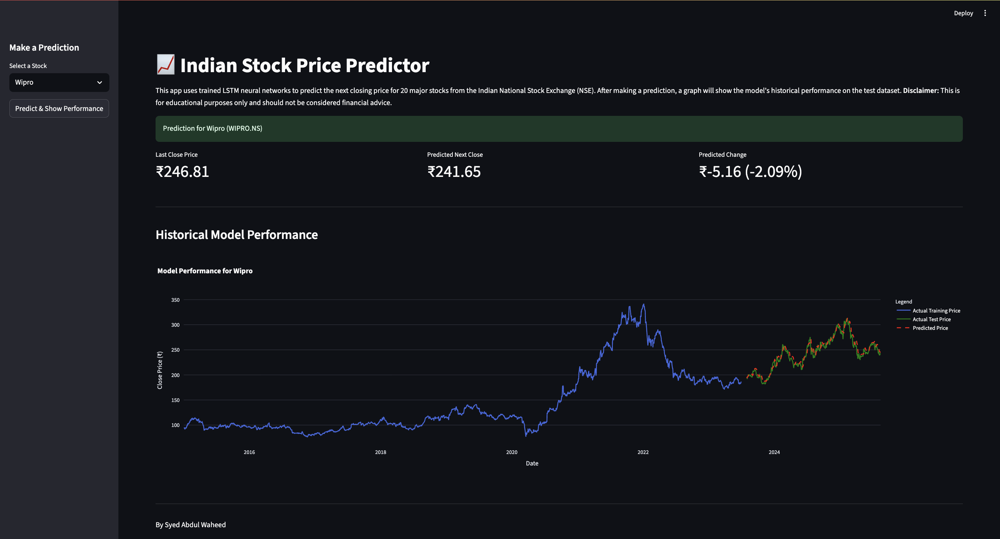
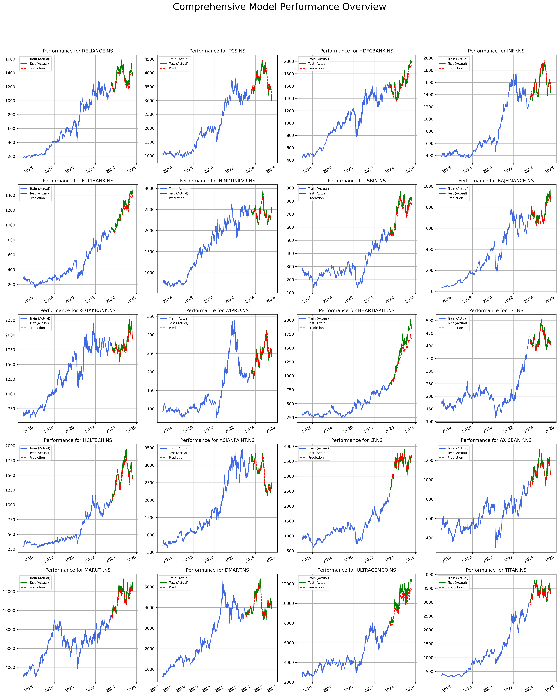

<div align="center">

  

  <br />

  <p>
    <a href="https://waheed-stock-price-prediction-lstm.streamlit.app/">
      
    </a>
    
    
  </p>

  <h3>🚀 Forecasting the Future with Deep Learning</h3>
  
  <p align="center">
    <i>"An automated end-to-end pipeline leveraging LSTM neural networks to predict stock market trends with high accuracy."</i>
  </p>
</div>

---

## 📈 Overview

This project addresses the challenging task of **stock market prediction** by leveraging the power of **Recurrent Neural Networks (RNNs)**. 

We utilize a **Long Short-Term Memory (LSTM)** architecture trained on historical data (2015–Present) to identify complex temporal patterns and forecast the next day’s closing price. The entire pipeline—from **data acquisition** to **model training** and **deployment**—is automated.

---

## 📸 Demo & Output

### 🎯 Live Prediction Dashboard
<div align="center">
  
</div>

<br />

### 📊 Comprehensive Model Plots
<div align="center">
  
</div>

---

## ✨ Key Features

- 🧠 **Deep Learning Core**: Robust LSTM neural network optimized for time-series forecasting.
- 🤖 **Automated Pipeline**: Single script handles fetching, preprocessing, and training for **20+ stocks**.
- 🌐 **Interactive Web Interface**: Clean, responsive Streamlit dashboard for real-time user interaction.
- 📊 **Instant Inference**: Select any stock ticker to get immediate next-day price predictions.
- 📈 **Visual Analytics**: Interactive Plotly graphs comparing Predicted vs. Actual values.
- 🔁 **Reproducibility**: Fixed random seeds ensure consistent training results every run.

---

## 🛠 Technology Stack

| Component | Technology | Description |
| :--- | :--- | :--- |
| **Language** |  | Core logic and scripting |
| **Modeling** |  | Building LSTM Architecture |
| **Frontend** |  | Web Application Interface |
| **Data Ops** |  | Data manipulation & Preprocessing |
| **Source** |  | Real-time Stock Data API |
| **Viz** |  | Interactive Charts |

---

## 📊 Model Performance

The models were trained on historical data with an **80/20 train-test split**. Below is the performance summary ranked by accuracy (R² Score):

| Rank | Stock Ticker | R² Score | RMSE (₹) | Performance Verdict |
|:---:|:---|:---:|:---:|:---|
| 🥇 | **WIPRO.NS** | **94.37%** | ₹7.38 | 🟢 **Excellent** |
| 🥈 | **ICICIBANK.NS** | **94.19%** | ₹40.52 | 🟢 **Excellent** |
| 🥉 | **ASIANPAINT.NS** | **94.11%** | ₹88.09 | 🟢 **Excellent** |
| 4 | INFY.NS | 92.88% | ₹51.28 | 🟢 Excellent |
| 5 | LT.NS | 92.61% | ₹79.49 | 🟢 Excellent |
| 6 | HCLTECH.NS | 90.98% | ₹66.22 | 🟢 Very Good |
| 7 | BAJFINANCE.NS | 90.88% | ₹27.04 | 🟢 Very Good |
| 8 | TCS.NS | 90.54% | ₹112.43 | 🟢 Very Good |
| 9 | HINDUNILVR.NS | 89.85% | ₹52.49 | 🟢 Very Good |
| 10 | DMART.NS | 89.64% | ₹163.88 | 🟢 Very Good |
| 11 | SBIN.NS | 88.48% | ₹33.15 | 🟡 Good |
| 12 | KOTAKBANK.NS | 88.01% | ₹52.00 | 🟡 Good |
| 13 | AXISBANK.NS | 87.87% | ₹30.05 | 🟡 Good |
| 14 | MARUTI.NS | 87.63% | ₹358.22 | 🟡 Good |
| 15 | HDFCBANK.NS | 86.10% | ₹64.62 | 🟡 Good |
| 16 | BHARTIARTL.NS | 84.78% | ₹132.57 | 🟡 Decent |
| 17 | ITC.NS | 84.13% | ₹11.30 | 🟡 Decent |
| 18 | RELIANCE.NS | 80.20% | ₹53.19 | 🟡 Decent |
| 19 | TITAN.NS | 77.09% | ₹99.99 | 🟠 Fair |
| 20 | ULTRACEMCO.NS | 73.44% | ₹652.85 | 🟠 Fair |

---

## ⚙️ Local Setup

Follow these steps to run the project locally on your machine:

```bash
# 1. Clone the repository
git clone [https://github.com/Syed-Waheed/stock-price-prediction-lstm.git](https://github.com/Syed-Waheed/stock-price-prediction-lstm.git)

# 2. Navigate to the directory
cd stock-price-prediction-lstm

# 3. Install dependencies
pip install -r requirements.txt

# 4. Run the Streamlit App
streamlit run app.py
```
---
                    USER
                      ↓
             Natural language
                      ↓
               Query Planner
                      ↓
        ┌─────────────┴─────────────┐
        ↓                           ↓
   Structured data            Unstructured data
        ↓                           ↓
 SQL/Pandas analysis             RAG/NLP
        ↓                           ↓
        └─────────────┬─────────────┘
                      ↓
                 Validation
                      ↓
              Insight Generation
                      ↓
          ┌───────────┼───────────┐
          ↓           ↓           ↓
       Chart       Dashboard    Report
                                  ↓
                            PDF / Export

                            

## 👤 Author

<div align="left">
  

  **Syed Abdul Waheed**  
  *Data Science Enthusiast | Python Developer | Automation Explorer*

  Passionate about bridging the gap between data and actionable insights through Deep Learning.

  <br />

  <a href="https://www.linkedin.com/in/syed-abdul-waheed/">
    
  </a>
  <a href="https://github.com/Syed-Waheed">
    
  </a>
</div>

<br clear="left"/>

<div align="center">
  <p>If you found this project useful, please ⭐ the repository!</p>
</div>

---


